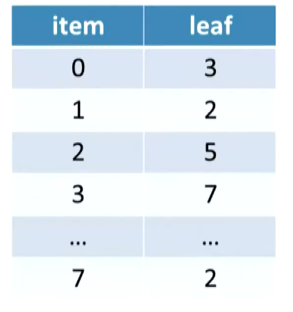
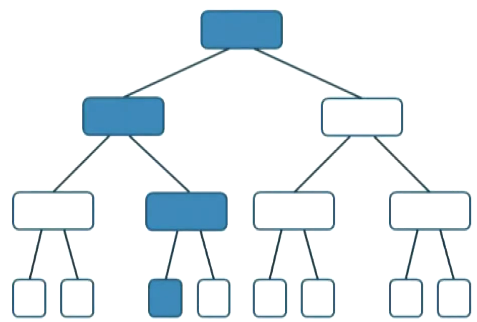

# ORAM
Oblivious RAM also known as ORAM is a cryptographic technique designed to enhance the privacy and security of data storage and retrieval in computer systems. In traditional Random Access Memory (RAM) systems, the search and access patterns of data can leak sensitive information. ORAM aims to mitigate this risk by obfuscating the search and access patterns, making it difficult for adversaries to infer the content or the operations being performed on the data.

One of the key advantages of using Oblivious RAM is its ability to provide provable security guarantees against various forms of attacks, including memory side-channel attacks and data leakage through timing analysis. ORAM achieves this by introducing randomness into the way data is stored and accessed, effectively masking the true data access patterns. As a result, even if an attacker gains access to the memory access traces, they cannot deduce the relationships between the data items or the sequence of operations performed on them that we qualify as oblivious (hence the name).

The setting for ORAM use can be found where the client only has small secure memory and still wants to store data on an untrusted server. Because the client desires to keep confidentiality in its data, the use of ORAM allows him to hide access pattern (and partially the search pattern).

### Immediate implications of ORAM
This implies that
- Client has a private, secure source of randomness.
- Outsourced data must be encrypted using a semantically secure encryption scheme.
- Each access to the remote server must include a read **and** a write operation.
- Client stores a table of data locations and its location must be independant from the index it is stored at.
- Two accesses at the same index $i$ does not imply that the same data is accessed.

It efficiently prevents cache attacks (Osvik-Shamir-Tromer).

### Existing ORAM algorithms
There are multiple algorithms proposed to implement Oblivious RAM protocols, some more efficients than others (Trivial ORAM, Square Root ORAM, Hierarchical ORAM...).
The one implemented here is the Path-ORAM with an overhead complexity of $O(log\ N)$.

### Path-ORAM
Path-ORAM is an implementation of the algorithm of the same name first anounced in `https://eprint.iacr.org/2013/280.pdf`. It consists on a **complete** binary (or general) tree with $n$ nodes, $logn$ levels and $2^{\lceil{logn}\rceil - 1}$ leaves and where each node contains a bucket of data items of constant size.

The client needs to store the position map of all elements stored remotely. This consists in $O(n)$ storage of $logn$ bits long.



An item is always stored **somewhere** on the path from the root to its leaf. For item $0$ at leaf $3$, we would know it belongs to this path without knowing where at in the path.



#### Accessing an item
Read the path from root to leaf. Visit each node in the path and return each elements in the bucket of the node. Client now decrypts and optionnaly changed accessed items regarding his needs. Upon writing back the items, the client encrypts them again (using a different nonce) and assigns a new position to affected items (drawn at random following a uniform distribution among the leaves). When writing elements back to the tree, the path to write elements at is the same as for reading but elements are greedily filled from bottom to up (right side visit of the tree) and they have to be assigned to a node belonging to their path. This means that changed elements will only be written at a node which intersects the read-path and the new assigned-path.

There is a possibility, after each R/W operation that all elements could not be written back to the tree. This is why the client stores a stash (client-side for now). It is said that Path-ORAM fails only when the stash size is greater than $O(logn)$ and this happens with probability lesser than $14 \times 0.6002^{-R}$.

Path-ORAM achieves $O(logn)$ overhead complexity and $O(logn)$ client storage **with large data items.** Fun fact, there are hardware implementations of Path-ORAM.

### Recursive ORAM
One could reduce overhead by introducing recursive ORAM. Instead of performing plain search on nodes buckets, perform ORAM search on them. Each layer of recursion then diminishes overhead complexity by a factor of logarithmic order.

### Build, test, and run
To build this program, `cargo 1.67.1` is needed.

Simply run `cargo build` followed by `cargo run`.

The tests can be performed using `cargo test`.

#### Userside
Anyone intending to use this code should only worry about client/server(oram) creation, read/write operations and arbitrary changes on data between read and write. Such an example is given in `src/main.rs` and can be found below.

```rs

let nb_items: usize = 183;
let ct_size: usize = 16;

let mut client = ClientOram::new(nb_items);
let mut csprng = CsRng::from_entropy();

// Potential insertions of elements at the start:
// - read will only gather dummies.
// - write takes an optional argument of elements to insert.
// They must also be inserted in the position map to query for them later.

let mut oram = client.setup_oram(ct_size)?;

let path = 22; // Arbitrary.
let mut read_data = client.read_from_path(&mut oram, path)?;

/* Changing the element at idx 6 in the values obtained. */
/* ----------------------------------------------------- */
let idx_data_item_to_change = 6;

// First remove old element from position map.
client.delete_element_from_position_map(&read_data[idx_data_item_to_change]);

// Let's pretend the user changes the element.
let data_changed = read_data[idx_data_item_to_change].data_as_mut();
data_changed[0] = 255;

// Insert back changed element into position map.
client.insert_element_in_position_map(&read_data[idx_data_item_to_change]);

// Writing elements back to the path without inserting anything new.
client.write_to_path(&mut oram, &mut read_data, Option::None, path)?;
```
It should be stressed that **each read operation MUST be followed by a write operation on the same path**.

### Resources
- Software Protection and Simulations on Oblivious-RAMs - Goldreich, Ostrovsky 1992.
- Oblivious RAM with O((log N )^3) Worst-Case Cost - Shi et al. 2011.
- Path ORAM: An Extremely Simple Oblivious RAM Protocol - Stefanov et al. 2012.
- Secure Computation and Efficiency course - Prof. Benny Pinkas at *Bar-Ilan University, Israel 2015*
